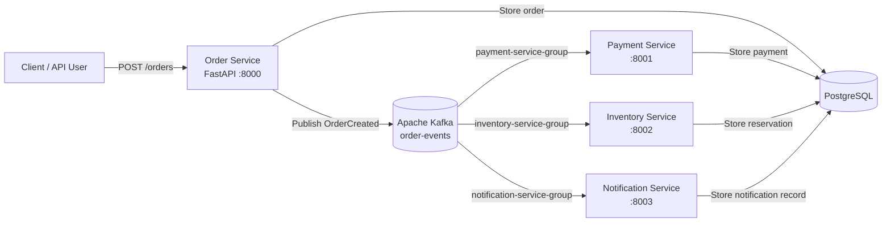

# Distributed Order Processing System

An event-driven distributed order processing system built with **Python, FastAPI, Apache Kafka, PostgreSQL, and Docker Compose**.

The project demonstrates how a simple order workflow can be split into independently deployable microservices that communicate asynchronously through Kafka.

---

## 1. What does this project solve?

In a tightly coupled order system, the service that creates an order might directly call payment, inventory, and notification services:

```text
Order Service
    |
    +----> Payment Service
    |
    +----> Inventory Service
    |
    +----> Notification Service
```

This creates stronger dependencies between services. If one downstream service is unavailable, the order workflow can become difficult to manage.

This project uses an **event-driven architecture** instead:

```text
Order Service
      |
      | OrderCreated event
      v
    Kafka
      |
      +----------> Payment Service
      |
      +----------> Inventory Service
      |
      +----------> Notification Service
```

The Order Service creates the order and publishes an `OrderCreated` event. Other services consume that event independently and perform their own work.

This gives us a small but realistic example of:

- Microservice architecture
- Event-driven architecture
- Asynchronous communication
- Kafka producers and consumers
- Kafka consumer groups
- Partitioned Kafka topics
- Manual offset commits
- Retry handling
- Idempotent event processing
- Dockerized services
- PostgreSQL persistence
- End-to-end testing

---

# 2. Architecture



## High-level flow

1. A client sends `POST /orders` to the Order Service.
2. The Order Service validates the request.
3. The order is stored in PostgreSQL.
4. The Order Service publishes an `OrderCreated` event to Kafka.
5. Payment, Inventory, and Notification services consume the event independently.
6. Each service performs its own business operation.
7. Each consumer commits its Kafka offset only after successful processing.
8. Failed processing is retried.
9. Duplicate events are handled using `order_id` as an idempotency key.

---

# 3. Microservices

## Order Service

**Port:** `8000`

Responsibilities:

- Accept new orders
- Validate incoming order data
- Store orders
- Publish `OrderCreated` events
- Retrieve orders

Endpoints:

```text
GET  /
POST /orders
GET  /orders
GET  /orders/{order_id}
```

---

## Payment Service

**Port:** `8001`

Responsibilities:

- Consume `OrderCreated`
- Process payment
- Store payment results
- Avoid duplicate payment processing
- Retry failed event processing

Consumer group:

```text
payment-service-group
```

---

## Inventory Service

**Port:** `8002`

Responsibilities:

- Consume `OrderCreated`
- Reserve inventory
- Store reservation results
- Avoid duplicate reservations
- Retry failed event processing

Consumer group:

```text
inventory-service-group
```

---

## Notification Service

**Port:** `8003`

Responsibilities:

- Consume `OrderCreated`
- Simulate sending an order notification
- Store notification records
- Avoid duplicate notifications
- Retry failed event processing

Consumer group:

```text
notification-service-group
```

---

# 4. Technology Stack

| Technology | Purpose |
|---|---|
| Python 3.13 | Application language |
| FastAPI | REST API framework |
| Apache Kafka 4.3.1 | Event streaming and asynchronous communication |
| Confluent Kafka Python Client | Kafka producer and consumer |
| PostgreSQL 17 | Persistent data storage |
| SQLAlchemy | Python ORM and database access |
| Docker | Containerization |
| Docker Compose | Multi-container orchestration |
| pytest | Automated testing |
| Git / GitHub | Version control |

---

# 5. Kafka Design

The system currently uses one main Kafka topic:

```text
order-events
```

The topic has **3 partitions**.

The Order Service acts as the producer.

The other services act as independent consumers.

### Consumer groups

```text
order-events
    |
    +---- payment-service-group
    |
    +---- inventory-service-group
    |
    +---- notification-service-group
```

Each consumer group receives the complete event stream independently.

For example, if an order produces:

```text
OrderCreated ORDER-1001
```

all three consumer groups can receive that event.

This is different from putting all three services into one consumer group, where Kafka would distribute messages among the consumers instead.

---

# 6. OrderCreated Event

An example event published to Kafka looks like:

```json
{
  "event_type": "OrderCreated",
  "order_id": "8af12c7e-...",
  "customer_id": 101,
  "product_id": 5001,
  "quantity": 2,
  "amount": 1499.99
}
```

The `order_id` is used as the Kafka message key.

This gives the system a stable identifier for the business operation and is also used for idempotency.

---

# 7. Persistence

The project uses one PostgreSQL container to keep the local development environment simple.

The services logically own separate tables:

```text
PostgreSQL
├── orders
├── payments
├── inventory_reservations
└── notifications
```

The important architectural rule is that each service owns its own data and business logic.

We intentionally use one PostgreSQL container instead of running several database servers because the goal of this project is to demonstrate Kafka and distributed service behavior without unnecessary infrastructure overhead.

---

# 8. Retry and Failure Handling

Kafka events are not acknowledged as successfully processed until the business operation completes.

The consumers use:

```text
enable.auto.commit = false
```

and commit the Kafka offset only after successful processing.

### Retry flow

```text
Kafka event
    |
    v
Attempt 1
    |
   fail
    v
Attempt 2
    |
   fail
    v
Attempt 3
    |
   success
    v
Commit offset
```

The current implementation uses up to **3 processing attempts** with a short increasing delay between attempts.

If processing still fails, the offset is not committed, so the message remains available for later processing.

---

# 9. Idempotency

Distributed systems can encounter duplicate delivery or repeated processing attempts.

The project prevents duplicate business records by using `order_id` as the idempotency key.

For example:

```text
OrderCreated ORDER-1001
        |
        v
Payment processed
        |
        v
Same event received again
        |
        v
Payment already exists
        |
        v
Skip duplicate processing
```

The same principle is applied to:

- Payments
- Inventory reservations
- Notifications

The database also enforces uniqueness on `order_id` for these records.

---

# 10. Docker Architecture

The complete system runs with Docker Compose:

```text
Docker Compose
│
├── postgres
│
├── kafka
│
├── order-service
│
├── payment-service
│
├── inventory-service
│
└── notification-service
```

Services communicate with each other through Docker's internal network using service names such as:

```text
postgres:5432
kafka:9092
```

The host machine can access the APIs through:

```text
Order Service       http://localhost:8000
Payment Service     http://localhost:8001
Inventory Service   http://localhost:8002
Notification       http://localhost:8003
```

---

# 11. Project Structure

```text
distributed-order-processing/
│
├── order-service/
│   ├── app/
│   │   ├── __init__.py
│   │   ├── database.py
│   │   ├── kafka_producer.py
│   │   ├── main.py
│   │   ├── models.py
│   │   └── order_service.py
│   ├── Dockerfile
│   ├── requirements.txt
│   └── test_order_service.py
│
├── payment-service/
│   ├── app/
│   │   ├── __init__.py
│   │   ├── database.py
│   │   ├── kafka_consumer.py
│   │   ├── main.py
│   │   ├── models.py
│   │   └── payment_service.py
│   ├── Dockerfile
│   └── requirements.txt
│
├── inventory-service/
│   ├── app/
│   │   ├── __init__.py
│   │   ├── database.py
│   │   ├── kafka_consumer.py
│   │   ├── main.py
│   │   ├── models.py
│   │   └── inventory_service.py
│   ├── Dockerfile
│   └── requirements.txt
│
├── notification-service/
│   ├── app/
│   │   ├── __init__.py
│   │   ├── database.py
│   │   ├── kafka_consumer.py
│   │   ├── main.py
│   │   ├── models.py
│   │   └── notification_service.py
│   ├── Dockerfile
│   └── requirements.txt
│
├── tests/
│   └── e2e/
│       └── test_order_flow.py
│
├── docs/
│   └── testing.md
│
├── docker-compose.yml
├── .gitignore
└── README.md
```

---

# 12. Prerequisites

You need only:

- Docker Desktop
- Git
- Python 3.13+
- A GitHub account

You do **not** need to install PostgreSQL or Kafka directly on Windows.

PostgreSQL and Kafka run as Docker containers.

---

# 13. Running the Project

Clone the repository:

```cmd
git clone https://github.com/TarunMGowda/distributed-order-processing.git
cd distributed-order-processing
```

Start the containers:

```cmd
docker compose up -d --build
```

Check the containers:

```cmd
docker compose ps
```

You should see:

```text
order-postgres
order-kafka
order-service
payment-service
inventory-service
notification-service
```

---

# 14. Create the Kafka Topic

The application expects the following topic:

```text
order-events
```

If the topic does not already exist, create it with:

```cmd
docker exec order-kafka /opt/kafka/bin/kafka-topics.sh --create --topic order-events --bootstrap-server localhost:9092 --partitions 3 --replication-factor 1
```

Verify:

```cmd
docker exec order-kafka /opt/kafka/bin/kafka-topics.sh --describe --topic order-events --bootstrap-server localhost:9092
```

---

# 15. Use the API

Open the interactive FastAPI documentation:

```text
http://localhost:8000/docs
```

Create an order using:

```text
POST /orders
```

Example:

```json
{
  "customer_id": 101,
  "product_id": 5001,
  "quantity": 2,
  "amount": 1499.99
}
```

The Order Service returns an order such as:

```json
{
  "order_id": "8af12c7e-...",
  "customer_id": 101,
  "product_id": 5001,
  "quantity": 2,
  "amount": 1499.99,
  "status": "CREATED"
}
```

The event is then published to Kafka and consumed independently by Payment, Inventory, and Notification services.

---

# 16. Useful Commands

### View all containers

```cmd
docker compose ps
```

### Follow all service logs

```cmd
docker compose logs -f
```

### Follow one service

```cmd
docker compose logs -f payment-service
```

### Restart one service

```cmd
docker compose restart payment-service
```

### Stop one service

```cmd
docker compose stop payment-service
```

### Start it again

```cmd
docker compose start payment-service
```

### Stop the whole system

```cmd
docker compose down
```

### Rebuild everything

```cmd
docker compose up -d --build
```

> **Reset note:** `docker compose down` keeps the named PostgreSQL and Kafka volumes. To completely reset stored data, use `docker compose down -v`.

---

# 17. Testing

Run the complete test suite:

```cmd
pytest -v
```

The project contains:

### Unit tests

Tests the Order Service's core business logic.

### End-to-end tests

The end-to-end test verifies:

1. All services are reachable.
2. An order can be created.
3. The Order Service publishes an `OrderCreated` event.
4. Payment processes the event.
5. Inventory processes the event.
6. Notification processes the event.
7. Each service creates exactly one corresponding record.

Run only the end-to-end tests:

```cmd
pytest tests\e2e\test_order_flow.py -v
```

---

# 18. Failure Demonstrations

The project can be used to demonstrate distributed-system behavior.

## Payment Service unavailable

Stop Payment:

```cmd
docker compose stop payment-service
```

Create an order.

Payment is unavailable, but the other consumers can continue processing their own work.

Start Payment again:

```cmd
docker compose start payment-service
```

The Payment consumer can then process events whose offsets were not successfully committed.

---

## Retry behavior

Consumer processing supports up to three attempts:

```text
Attempt 1 → failure
Attempt 2 → failure
Attempt 3 → success
```

Offsets are committed only after successful processing.

---

## Duplicate event handling

Payment, Inventory, and Notification check whether the order has already been processed before creating a new business record.

This prevents duplicate side effects when the same event is processed more than once.

---

# 19. Design Decisions

## Why Kafka?

Kafka allows the Order Service to publish an event without tightly coupling the order workflow to downstream services.

The Payment, Inventory, and Notification services can consume events independently.

## Why asynchronous communication?

Payment, inventory reservation, and notification do not need to be implemented as direct synchronous calls from the Order Service.

Asynchronous events improve decoupling and allow consumers to recover independently.

## Why consumer groups?

Each downstream service needs its own copy of every `OrderCreated` event.

Therefore each service uses a separate consumer group.

## Why Docker Compose?

The project has several infrastructure and application components.

Docker Compose makes it possible to start the entire local environment consistently with one command.

## Why one PostgreSQL container?

Multiple database servers would add infrastructure complexity without improving the main learning objectives of this project.

Separate tables and service ownership are sufficient for this demonstration.

## Why not Kubernetes?

Kubernetes would introduce deployment and orchestration complexity that is not necessary for the project's core learning objectives.

Docker Compose is enough to demonstrate containerized microservices.

---

# 20. Current Limitations

This project is intentionally simplified for learning and interview demonstration.

It does not currently implement:

- Real payment gateway integration
- Real email/SMS delivery
- Inventory stock levels across multiple warehouses
- Authentication and authorization
- API Gateway
- Service discovery
- Kubernetes
- Distributed tracing
- Production-grade secret management
- Dead-letter topics
- Schema Registry
- Kafka Streams

These are natural extensions for a production system but are intentionally outside the scope of this project.

---

# 21. Future Improvements

Possible next steps include:

1. Add dedicated databases per service.
2. Add Kafka dead-letter topics.
3. Introduce richer event schemas and versioning.
4. Add authentication.
5. Add an API Gateway.
6. Add Kubernetes deployment.
7. Add distributed tracing.
8. Add real notification providers.
9. Add inventory stock management.
10. Add a proper order lifecycle with events such as `PaymentCompleted` and `InventoryReserved`.

---

# 22. What this project demonstrates

This project is designed to demonstrate practical understanding of:

```text
Python
FastAPI
REST APIs
Microservices
Apache Kafka
Kafka Producers
Kafka Consumers
Consumer Groups
Partitions
Offsets
Asynchronous Communication
Event-Driven Architecture
PostgreSQL
SQLAlchemy
Docker
Docker Compose
Retries
Idempotency
Failure Recovery
End-to-End Testing
```

The most important architectural idea is:

> The Order Service produces an event, while independent downstream services react to that event without requiring direct synchronous communication between them.

---

# 23. Learning Outcomes

After building the project, you should be able to explain:

- How a request travels through the Order Service
- How an order is persisted in PostgreSQL
- How an `OrderCreated` event is produced
- What a Kafka topic and partition are
- What a consumer group is
- Why three services can consume the same event independently
- What happens when a consumer fails
- Why Kafka offsets are committed after successful processing
- Why duplicate events can happen
- How idempotency prevents duplicate side effects
- How Docker containers communicate
- How Docker Compose starts the complete system
- How the end-to-end test validates the distributed workflow

---

## License

This project is intended as a learning and portfolio project.
